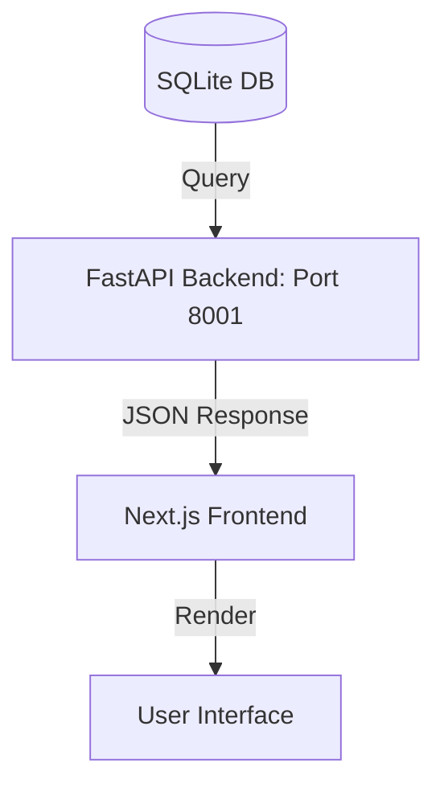

# Phantom Theme Design System

This document is the authoritative reference for the Badminton App frontend ("Phantom" theme). All components, pages, and future agents must adhere to these guidelines to maintain visual and behavioral consistency.

> **Last audited**: May 2026

---

## 1. Foundations

### 1.1 Typography
- **Font Stack**: Geist Sans (`--font-geist-sans`) for body, Geist Mono (`--font-geist-mono`) for data.
- **Headings**: `font-bold text-zinc-100`. Page titles use `text-4xl md:text-5xl tracking-tight`.
- **Body Text**: `text-zinc-400`.
- **Monospace Data**: All ratings, scores, dates, ranks, and KPI values use `font-mono`.
- **Micro Labels**: `text-[9px] md:text-[10px] text-zinc-500 uppercase tracking-widest font-bold`.
- **Text Wrapping for Names**: Long player names in dashboards, cards (e.g. Giant Slayer, Global Top Mover), and tables should wrap onto multiple lines using class combinations such as `break-words whitespace-normal leading-tight line-clamp-2` instead of clipping or truncating. Associated country flags should be scaled down accordingly (e.g., `scale-[0.35]`) to prevent layout clipping.

### 1.2 Color Palette

| Token | Tailwind Class | Hex | Usage |
| :--- | :--- | :--- | :--- |
| **Background** | `bg-zinc-950` | `#09090b` | Page & body background |
| **Card Surface** | `bg-zinc-900` | `#18181b` | Card backgrounds, dropdowns, tooltips |
| **Recessed Surface** | `bg-zinc-950/40` | — | Utility inputs (Jump to Rank), secondary controls |
| **Border** | `border-zinc-800` | `#27272a` | Standard card & section borders |
| **Border (subtle)** | `border-zinc-800/50` | — | Inner separators, chart containers |
| **Primary Text** | `text-zinc-100` | `#f4f4f5` | Player names, primary data |
| **Secondary Text** | `text-zinc-400` | `#a1a1aa` | Descriptions, body copy |
| **Muted Text** | `text-zinc-500` | `#71717a` | Labels, axis text, metadata |
| **Ghost Text** | `text-zinc-600` | `#52525b` | Tertiary labels, model notes |

### 1.3 Accent Colors

| Token | Tailwind Class | Hex | Usage |
| :--- | :--- | :--- | :--- |
| **Primary Accent** | `text-sky-400` | `#38bdf8` | Ratings, peak values, chart lines, KPI highlights |
| **Brand Accent** | `text-cyan-400` | `#22d3ee` | Logo, page title highlights, hero text, sparklines |
| **Positive** | `text-emerald-400` / `text-emerald-500` | `#34d399` / `#10b981` | Wins, positive trends, active status |
| **Negative** | `text-rose-400` / `text-rose-500` | `#fb7185` / `#f43f5e` | Losses, negative trends |

> [!IMPORTANT]
> **Sky Blue (`#38bdf8`) is the primary data accent.** Use it for all analytical values: ratings, peak ratings, chart strokes, and popover KPIs. Reserve Cyan (`#22d3ee`) exclusively for branding elements (logo, hero text, sparkline hover states). Do not mix them within the same analytical context.

### 1.4 Rank Tier Colors (Leaderboard Borders)
Applied via `getDesaturatedBorderColor()`:
- **#1 (Champion)**: Dark Red `rgba(127, 29, 29, α)`
- **#2–3 (Elite)**: Dark Blue `rgba(30, 58, 138, α)`
- **#4–10 (Top 10)**: Dark Green `rgba(6, 78, 59, α)`
- **#11–20 (Top 20)**: Dark Amber `rgba(180, 83, 9, α)`
- **#21+**: Standard Zinc `rgba(39, 39, 42, α)`

### 1.5 Active/Inactive Player Policy & BWF Column
- **Activity Grace Period**: Players are considered active if their last played match was within the past **8 months** (240 days).
- **Leaderboards**: Inactive players must be completely hidden from the seasonal view leaderboard, but displayed with active/inactive indicators on player profiles and leaderboard quickview cards.
- **BWF Rank Integration**: Leaderboards (ELO and WHR models) must display a `BWF Rank` column in both seasonal and all-time views, resolved dynamically from the BWF database mappings.


---

## 2. Layout Patterns

### 2.1 Page Structure
```
<body>  →  bg-zinc-950 text-zinc-100
  <nav>   →  border-b border-zinc-800 bg-zinc-950/80 backdrop-blur-md sticky top-0 z-50
  <main>  →  max-w-7xl mx-auto px-4 py-8
  <footer> → border-t border-zinc-800 bg-zinc-950
```

### 2.2 Background Pattern
All major pages use a `RetroGrid` overlay at `opacity-30`, plus a radial dot pattern:
```css
background-image: radial-gradient(rgba(255,255,255,0.08) 1px, transparent 0);
background-size: 36px 36px;
```

### 2.3 Control Bar (Leaderboard)
```
bg-zinc-900/50 p-4 rounded-lg border border-zinc-800/50 backdrop-blur-sm
```
- **Toggle Buttons (active)**: `bg-zinc-100 text-zinc-900 font-bold`
- **Toggle Buttons (inactive)**: `bg-zinc-800 text-zinc-400 border border-zinc-700 hover:bg-zinc-700`
- **Utility Inputs** (Jump to Rank): `bg-zinc-950/40 border-zinc-800/80` — slightly recessed from toggle buttons to create visual hierarchy.

### 2.4 Grid System
All tabular layouts use a `grid grid-cols-12 gap-4` pattern for consistent column alignment across the leaderboard and match cards.

---

## 3. Component Library

### 3.1 Buttons

**Primary (Phantom)**:
```html
<button class="px-4 py-2 bg-zinc-100 text-zinc-900 hover:bg-zinc-300
  shadow-[0_0_15px_rgba(255,255,255,0.1)] transition-all font-semibold rounded-lg">
  Action
</button>
```

**Ghost / Toggle (inactive)**:
```html
<button class="px-3 py-1.5 text-xs font-semibold bg-zinc-800 text-zinc-400
  border border-zinc-700 rounded-md hover:bg-zinc-700 hover:text-zinc-100 transition-all">
  Option
</button>
```

**Shine Effect**: All toggle buttons include a Framer Motion sweep animation:
```tsx
<motion.span
  className="absolute inset-0 bg-gradient-to-r from-transparent via-white/40 to-transparent"
  initial={{ x: '-100%' }}
  whileHover={{ x: '100%' }}
  transition={{ duration: 0.5, ease: 'easeInOut' }}
/>
```

### 3.2 Magic UI Components
Located in `@/components/magicui/`:

| Component | Purpose |
| :--- | :--- |
| `ShinyButton` | Button with a moving shine effect on hover |
| `NumberTicker` | Animates numbers counting up on mount |
| `BorderBeam` | Moving glow effect around card borders (used on top-ranked cards) |
| `RetroGrid` | Subtle background grid pattern |
| `AnimatedBeam` | Shows data flow between nodes |
| `BentoGrid` / `BentoCard` | Dashboard card layout system |
| `Dock` | macOS-style dock component |

### 3.3 Flags (Flagpack)
Dark-mode treatment to prevent flags from being visually loud:
```html
<div class="grayscale-[0.2] opacity-80 group-hover:grayscale-0
  group-hover:opacity-100 transition-all w-8 h-6 rounded-sm bg-zinc-800">
  <Flag code="US" />
</div>
```

### 3.4 Icons (Hugeicons)
- Package: `@hugeicons/react` with `@hugeicons/core-free-icons`
- Style: **Stroke Rounded**
- Stroke width: `1.5px`

---

## 4. Data Visualization

### 4.1 Recharts Configuration (Leaderboard Popover)

**Chart Container**:
```
rounded-xl bg-zinc-950/50 border border-zinc-800/50 p-4
```

**Grid**:
```tsx
<CartesianGrid stroke="#18181b" vertical={false} strokeDasharray="3 3" />
```

**Axes**:
```tsx
<XAxis
  tick={{ fontSize: 10, fill: '#52525b', fontFamily: 'monospace' }}
  axisLine={false} tickLine={false}
/>
<YAxis
  tick={{ fontSize: 10, fill: '#52525b', fontFamily: 'monospace' }}
  axisLine={false} tickLine={false}
/>
```

**Area Line**:
```tsx
<Area type="monotone" stroke="#38bdf8" strokeWidth={2} fill="url(#popoverGlow)" />
```

**Gradient Fill**:
```tsx
<linearGradient id="popoverGlow" x1="0" y1="0" x2="0" y2="1">
  <stop offset="5%" stopColor="#38bdf8" stopOpacity={0.2} />
  <stop offset="95%" stopColor="#38bdf8" stopOpacity={0} />
</linearGradient>
```

**Tooltip**:
```tsx
contentStyle={{
  backgroundColor: '#09090b',
  border: '1px solid #27272a',
  borderRadius: '8px',
  padding: '12px',
  boxShadow: '0 20px 40px rgba(0,0,0,0.5)',
  backdropFilter: 'blur(8px)'
}}
```

### 4.2 Sparklines (Leaderboard Table)
Inline SVG polylines using `text-cyan-400/50` with `group-hover:text-cyan-400`:
```html
<svg class="w-12 h-5" viewBox="0 0 100 24">
  <polyline fill="none" stroke="currentColor" strokeWidth="2.5"
    points="..." strokeLinecap="round" strokeLinejoin="round" />
</svg>
```

### 4.3 Player Page Rating Graph
Uses `#22d3ee` (cyan) for stroke and gradient fill. Includes custom dot rendering with a CSS `ripple` keyframe animation for peaks.

---

## 5. Interactive Patterns

### 5.1 Global Analytics Popover (Leaderboard)

**Backdrop**: `bg-black/40 backdrop-blur-sm` — semi-transparent, not opaque.

**Modal Container**: 
```
bg-zinc-950/80 backdrop-blur-md border border-zinc-800/80 rounded-2xl
shadow-[0_64px_256px_-24px_rgba(0,0,0,1)]
```

**Header Layout**: Player name (`font-bold text-4xl tracking-tight`) + inline KPI row:
```
Peak Rating  |  Win Rate  |  Status
  (sky-400)     (zinc-100)   (emerald-500 + pulse dot)
```

**Footer**: Minimal — model stream identifier + last match date.

### 5.2 Match Flip Card (Player Page)

**Interaction**: Single click anywhere to flip; single click again to flip back. No close button.

**Cooldown**: `2 × ANIMATION_DURATION` (currently 1.0s cooldown for a 0.5s flip).

**Front Side**: `bg-zinc-900/40 border-zinc-800/50 rounded-xl`, 12-column grid with date, tournament, result badge, participants, and score.

**Back Side**: `bg-zinc-950 border-sky-500/20 rounded-xl`, comparative "You vs Opponent" layout:
- Each side shows: Rating (`text-sky-400`), Rating Delta (▲/▼), and Rank.
- Right section: Win Probability + Match Details link.

**Result Badges**:
```
Won:  bg-emerald-500/20 text-emerald-400 border-emerald-500/30
Lost: bg-rose-500/20 text-rose-400 border-rose-500/30
```

### 5.3 Virtualization
- **Library**: `@tanstack/react-virtual` (`useWindowVirtualizer`)
- **Strategy**: Window scrolling with absolute positioning and dynamic measurement via `measureElement`.
- **Applied on**: Leaderboard table, player match history.

---

## 6. Animation Standards

### 6.1 Framer Motion Defaults
- **Page entrance**: `opacity: 0 → 1, y: 20 → 0`, `duration: 0.5`
- **Dropdown / Popover**: `opacity: 0 → 1, y: -5 → 0`, `duration: 0.2, ease: easeOut`
- **Modal scale**: `scale: 0.98 → 1`, spring or easeInOut

### 6.2 CSS Animations
- **Loading pulse**: `animate-pulse` on status dots and loading text
- **Loading bar**: Sky-blue sweep (`left: -100% → 100%`) with `shadow-[0_0_30px_#0ea5e9]`
- **Ripple dots**: Custom `@keyframes ripple` for chart peak markers
- **Outline shine**: Custom `@keyframes outline-move` for text glow effects

### 6.3 Custom CSS Utilities
Defined in `globals.css` for 3D card flipping:
```css
.perspective-1000  { perspective: 1000px; }
.preserve-3d       { transform-style: preserve-3d; }
.backface-hidden   { backface-visibility: hidden; }
.rotate-x-180      { transform: rotateX(180deg); }
```

---

## 7. Architecture

### 7.1 Tech Stack
- **Framework**: Next.js (App Router, `'use client'` pages)
- **Styling**: Tailwind CSS v4
- **Animation**: Framer Motion
- **Charts**: Recharts
- **Search**: cmdk (Command Palette)
- **Icons**: @hugeicons/react
- **Flags**: react-flagpack / custom `<Flag>` wrapper
- **API Resolution**: All frontend fetch queries must reference `API_BASE_URL` imported from `@/lib/api`. Do NOT hardcode the backend URL (which runs on port `8001` locally, rather than the default `8000`).

### 7.2 Data Flow


### 7.3 Key File Locations
| Path | Purpose |
| :--- | :--- |
| `app/layout.tsx` | Root layout, navbar, footer, font loading |
| `app/globals.css` | Theme variables, base styles, custom utilities |
| `app/page.tsx` | Home page with Bento Grid dashboard |
| `app/leaderboard/page.tsx` | Leaderboard table, popover, controls |
| `app/player/[id]/page.tsx` | Player profile, match history, prediction card |
| `components/magicui/` | Decorative UI primitives |
| `components/ui/` | Core UI primitives (Flag, Tooltip, NameShine) |
| `components/charts/` | Rating graph component |
| `components/bento-cards.tsx` | All dashboard bento card components |
| `components/giant-search.tsx` | Home page hero search |
| `components/search-bar.tsx` | Navbar search bar |
| `lib/api.ts` | API base URL configuration |
| `lib/countryCodes.json` | Country name → ISO code mapping |
| `lib/continentMapping.json` | Continent → country codes mapping |
